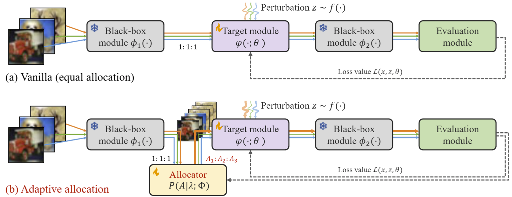

<!-- <div align="center"> -->

<!-- TITLE -->
# **FLOPS: Forward Learning with OPtimal Sampling**


<!-- DESCRIPTION -->
## Abstract
Given the limitations of backpropagation, perturbation-based gradient computation methods have recently gained focus for learning with only forward passes, also referred to as queries. Conventional forward learning consumes enormous queries on each data point for accurate gradient estimation through Monte Carlo sampling, which hinders the scalability of those algorithms. However, not all data points deserve equal queries for gradient estimation. In this paper, we study the problem of improving the forward learning efficiency from a novel perspective: how to reduce the gradient estimation variance with minimum cost? For this, we allocate the optimal number of queries within a set budget during training to balance estimation accuracy and computational efficiency. Specifically, with a simplified proxy objective and a reparameterization technique, we derive a novel plug-and-play query allocator with minimal parameters. Theoretical results are carried out to verify its optimality. We conduct extensive experiments for fine-tuning Vision Transformers on various datasets and further deploy the allocator to two black-box applications: prompt tuning and multimodal alignment for foundation models. All findings demonstrate that our proposed allocator significantly enhances the scalability of forward-learning algorithms, paving the way for real-world applications.

## Citation

If you find this work useful in your research, please cite:

```bibtex
@article{ren2024flops,
  title={FLOPS: Forward Learning with OPtimal Sampling},
  author={Ren, Tao and Zhang, Zishi and Jiang, Jinyang and Li, Guanghao and Zhang, Zeliang and Feng, Mingqian and Peng, Yijie},
  journal={arXiv preprint arXiv:2410.05966},
  year={2024}
}
```